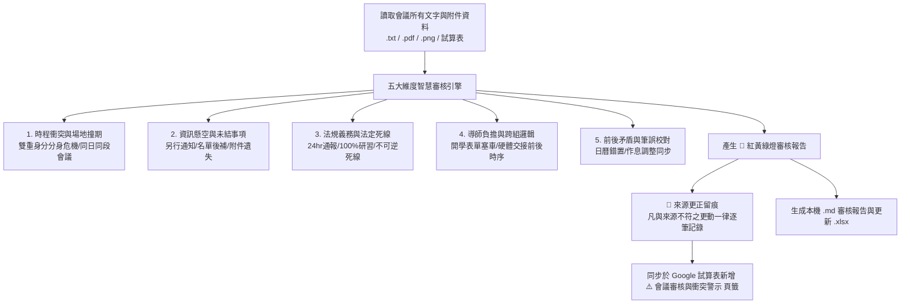

# 學校教師會議智慧審核與防呆檢核 Skill (Teacher Meeting Auditor)

## 📌 適用時機與觸發條件
當收到以下需求或情境時自動觸發本 Skill：
- 「審核教師會議」、「檢查會議衝突與地雷」、「審核 115XXXX 會議資料」
- 「會議撞期檢查」、「檢查表單是否漏掉」、「處室宣導防呆檢核」
- 使用者要求對已整理或進行中之學校會議進行合規性、可行性、時程衝突審查時。

---

## 🛠️ 標準作業流程 (Auditing SOP)



---

## 🔍 五大核心審核維度規範

### 維度一：時程衝突與場地撞期檢核（Collision Check）
1. **多重會議時間重疊檢核**：
   - 掃描同日、同一時段是否有 2 場以上之委員會或抽籤會議。
   - 標記具有**多重身分之教師**（例如：學扶授課教師、午餐委員、學年主任、兼任行政）是否會面臨「分身危機」。
2. **場地撞期與連續佔用檢核（R1 — 已機械化）**：
   - 檢核演講廳、未來教室、二樓會議室、綜合球場等公用場地是否在同一時段被多重預約。
   - **不只查重疊，也要查間隔**：同日同場地，前一場結束到下一場開始**不足 30 分鐘**即須提醒
     （清場、佈置與與會者移動時間不足；前一場一延遲就直接壓縮後一場）。
   - 刻意錯開之分梯設計（如 8:00／8:10 分班廣播）於資料層標 `venue_ok` 豁免，避免警示疲乏。

3. **同日雙重負擔檢核（R2 — 已機械化）**：
   - 同一日出現 **2 項以上**與使用者直接相關（標 ★）或全員必須出席之事項，即須輸出當日負擔警示；
     達 4 項以上升為 🔴 紅燈。
   - 典型案例：9/23 下午 CRC 全員法定研習 × 同日一、四年級尿液蟯蟲檢查。

---

### 維度二：資訊懸空與未結事項檢核（Dangling & Missing Items）
1. **懸空事項（Unknown Timeline）**：
   - 抓取所有標註「時間另行通知」、「待課表排定後通知」之事項（如：轉銜會議、游泳教學），列入專屬追蹤清單。
2. **名單與附件未到（Missing Materials）**：
   - 抓取「名單日後補上」、「詳如附件」但未見對應名冊之項目（如：閩客語 CD 四類生名冊）。
3. **無負責窗口標示**：
   - 檢查宣導事項是否有明確指派之主責處室、組別或承辦人分機。

---

### 維度三：法規義務與嚴格死線檢核（Compliance & Deadlines）
1. **法定時效通報**：
   - 檢核兒少保護、家暴性平是否有標註 **24 小時通報時效** 及輔導室窗口。
2. **法定全員必修研習**：
   - 檢核新北市智慧學習 5 項必修研習（A1, A2, A3, B5-1, 2030 未來教室）之 100% 達成率要求。
   - 檢核「兒童權利公約（CRC）」全校教職員 1 小時法定時數與辦理日期。
3. **不可逆行政死線**：
   - 檢核補考成績登錄、學生座號變更、逐年資料表更新之確切截止日與系統路徑。

4. **🚨 無死線的法定義務（R3 — 已機械化，最易整個消失）**：

   > 以日期為軸的檢核表，會讓「沒有截止日的義務」無處可掛，於是整項從表上消失，
   > 直到查核時才發現未達成。1150818 初版就漏掉了五項智慧學習必修研習。

   - 維護一份法定／強制義務清單（見 `d:\備課ai\行政事務\教師會議\scripts\audit_rules.py` 的 `STATUTORY`），
     每次審核逐條比對待辦總表：
     - **表中完全不存在** → 🔴 紅燈，並要求補入待辦表。
     - **已入表但本質無死線** → 🟡 黃燈，要求自訂內部檢核時點（無死線＝無人催辦）。
   - 這類義務入表時，`循環週期` 欄填 `無截止日` 或 `事件觸發`，不得硬編一個假日期。

---

### 維度四：導師負擔與跨處室協調邏輯（Workload & Cross-Dept Logic）
1. **開學前三日表單塞車檢核**：
   - 盤點返校日與開學第 1 週導師需發放與收回之所有表單（健康卡、緊急聯絡卡、逐年資料表、社福確認單、掃具需求表、借書證名冊、社團簡章）。
   - 自動生成「**導師收發表單防呆檢核表**」，標註收回期限與繳交處室。
2. **跨年級支援動線**：
   - 檢核外掃區支援機制（如五年級支援六年級畢旅外掃區），確認支援年級當週無重大校外教學撞期。
3. **硬體交接前後時序**：
   - 檢核電腦備份（8/23前）➔ 拆舊機（8/24）➔ 裝新機（8/25-26）時序是否合乎邏輯。

---

### 維度五：前後版本矛盾與筆誤校對（Diff & Typo Detection）
1. **行事曆與文字筆誤**：
   - 交叉比對文字中提及的星期與日期（如：週六、週三日期是否吻合實際行事曆）。
   - **每一個「日期＋星期」組合都必須用實際日曆驗算**，不可目視略過。
2. **生活作息與全校規範一致性**：
   - 檢核免費午餐新制後，中午放學時間修正為 `12:40～12:50` 是否已全面反映於導護時間、後門關閉時間與社團放學時間。

3. **🚨 來源更正強制留痕（Hard Rule — 不可省略）**：

   > **凡輸出內容與來源文件字面不一致者，一律不得靜默修正。**

   適用範圍：日期、星期、時間、數字、金額、地點、人名、處室之任何更動，
   以及「來源多份互相矛盾而擇一採用」的情形。

   - **必須**在審核報告與 `⚠️ 會議審核與衝突警示` 頁籤新增 `📝 來源更正` 專區，逐筆記錄：

     | 欄位 | 內容 |
     | :--- | :--- |
     | 來源寫 | 原文照抄（含出處檔名與段落） |
     | 實際應為 | 更正後的值 |
     | 判定依據 | 為何認定來源有誤（日曆驗算／同文件他處自相矛盾／另一份文件佐證） |
     | 處置 | `已更正` ／ `維持原文待確認` ／ `擇一採用待確認` |

   - **判定不出何者為真時，不得自行擇一定案**：來源互相矛盾且無第三方佐證者，
     一律標 🟡 黃燈「待處室確認」，並在正式表格中同時保留兩個版本與採用理由。
   - **系統自身勘誤同樣要留痕**：先前版本輸出錯誤而本次修正者，
     於同一專區標註「系統勘誤」，不得默默改掉。
   - 驗收條件：若本次審核有任何更正動作，`📝 來源更正` 專區**不得為空**。

---

## ⚙️ 機械化檢查（執行前必跑）

維度一的 R1／R2 與維度三的 R3 已實作為程式，**不依賴模型記得要查**：

```bash
cd "d:\備課ai\行政事務\教師會議"
python scripts/audit_rules.py [YYMMDD]          # 人可讀報告
python scripts/audit_rules.py [YYMMDD] --json   # 供程式取用
```

法定義務清單維護於 `scripts/audit_rules.py` 的 `STATUTORY`；
新會議若出現新的法定／強制義務，**先加進該清單再跑檢查**，否則 R3 查不到。

**SOP：先跑腳本取得 R1-R3 結果，再由模型補完 R1-R3 涵蓋不到的判斷**
（分身衝突、資訊懸空、表單塞車、筆誤校對）。腳本輸出的每一項都必須進入審核報告，
判定為誤報者不得逕自刪除，須在資料層標註豁免原因（如 `venue_ok`）並說明。

---

## 📊 標準產出成果

1. **🚦 紅黃綠燈審核報告（Markdown）**：
   - 🔴 **高風險警示（Red Flags）**：直接指出時間撞期、分身衝突、不可逆死線。
   - 🟡 **待追蹤清單（Yellow Flags）**：條列所有時間另行通知、名單後補之懸空項目。
   - 🟢 **合規良好項目（Green Flags）**：標註時序嚴謹、動線明確之模範規劃。
   - 📝 **來源更正紀錄（Source Corrections）**：依維度五 Hard Rule 逐筆列出所有與來源
     不一致之更動與其判定依據。**有更正就不得為空**。
2. **📑 Google 試算表同步擴充**：
   - 自動在目標 Google 試算表新增/更新第 5 個工作表：`⚠️ 會議審核與衝突警示`。
3. **💾 本機存檔**：
   - 更新同目錄下之 `[YYMMDD]教師會議整理與待辦檢核表.xlsx` 與 `[YYMMDD]教師會議審核報告.md`。
