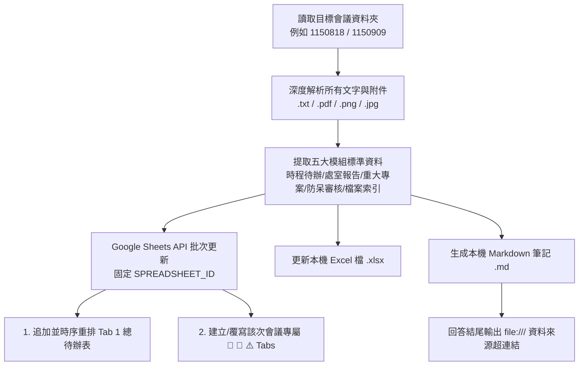

# 學校教師會議自動化整理與 Google 試算表產出 Skill (Teacher Meeting Organizer)

## 📌 適用時機與觸發條件
當收到以下需求或情境時自動觸發本 Skill：
- 「請整理 1150818 的會議資料」、「整理今天晨會」
- 「教師會議整理」、「會議輸出成 Google 試算表」、「產生這次會議的待辦清單」
- 工作目錄為 `d:\備課ai\行政事務\教師會議\[YYMMDD]\` 或使用者指定特定會議日期時。

---

## 🏗️ 全學年單一總表架構（方案 A：待辦累加總表制）

為了讓全校師生與行政團隊**「整學年只要存一個 Google 試算表網址」**，所有後續會議一律採用 **方案 A** 架構進行擴充維護：

* **全學年固定試算表網址**：[👉 碧華國小 115 學年度教師會議整理與待辦檢核總表](https://docs.google.com/spreadsheets/d/17vdUkxEz1-jD0CuNzufsWRSaG05GKWX75y2iFlCIglU/edit)
* **固定 SPREADSHEET_ID**：`17vdUkxEz1-jD0CuNzufsWRSaG05GKWX75y2iFlCIglU`

### 📑 工作表（Tabs）標準規範：
1. **`📋 115學年時程與待辦總檢核表`（全期總表）**：
   - **核心機制**：每次新會議產生的待辦事項，**自動合併追加進此工作表**，並依「截止日期」重新時序排序。
   - **互動功能**：A 欄內建 Checkbox 核取方塊，打勾自動整列畫刪除線並反灰；凍結首行；深藍表頭。
   - **年級篩選**：預設專注保留「中年級（三/四年級）、四年級專屬、全校性」待辦事項。
2. **`🏢 MMDD 處室業務報告`（該次會議處室專屬頁籤）**：
   - 每次會議新增獨立頁籤（如 `🏢 0818 處室業務報告`、`🏢 0909 處室業務報告`）。
   - 完整收錄校長致詞、教務處、學務處、總務處、輔導處、幼兒園等處室宣導全文。
3. **`🌟 MMDD 重大專案與附件精華`（該次附件深度解析）**：
   - 每次會議新增獨立頁籤（如 `🌟 0818 重大專案與附件精華`）。
   - 結構化收錄作息異動、體能計算公式、外掃區劃分、防災地圖、比賽期程等。
4. **`⚠️ MMDD 會議審核與衝突警示`（智慧防呆檢核）**：
   - 連動 `teacher-meeting-auditor` Skill，輸出紅黃綠燈診斷結果。
5. **`📁 原始檔案與資料來源索引`**：
   - 全學年所有會議之附件檔案總清單與本機路徑。

---

## 🎯 資料信心標記規範（Confidence Marking — 不可省略）

> **不確定比猜錯有價值。來源沒寫的，不准寫得像來源有寫。**

抽取每一筆待辦時，`地點`、`時間`、`主責處室`、`適用對象` 四欄一律回查來源原文，分三級處理：

| 級別 | 判準 | 資料層寫法 | 呈現 |
| :--- | :--- | :--- | :--- |
| **確定** | 來源明載，或僅為同義換句話說（如「校網公告」→「學校首頁校網」） | 不加註記 | 原值 |
| **推測** | 來源未明載，但依文件脈絡可合理推得，且該推測有實用價值 | `"inferred": {"place": "理由"}` | 值後加 **（推測）** |
| **未載明** | 來源完全未提，硬填只會產生「學校指定地點」這類無資訊量的填充詞 | `"unstated": {"place": "理由"}`，值改為 `未載明` | **未載明** |

**硬性禁止**：
- 不得為了讓表格看起來完整而填入「學校指定地點」「輔導處指定地點」「排定時段」這類空話 —— 一律改標 `未載明`。
- 推測必須在 `inferred` 內寫明理由（來源原文寫了什麼、推測的是哪一部分）。
- 標記由 `scripts/meeting_sync.py` 的 `render_field()` 統一渲染，**不可在資料層手動寫入「（推測）」字樣**，
  否則會與比對邏輯的後綴剝離衝突。

**驗收條件**：整份 `todos.json` 不得出現「指定地點」「排定時段」等填充詞。

---

## 🛠️ 標準作業流程 (SOP)



---

## 👤 關聯性過濾（relevance）

過濾維度為「中年級（三/四）、四年級專屬、全校性」。**但不得靠刪除資料來達成** ——
委員會、主任會議這類項目雖非本人業務，卻是 `audit_rules.py` 判定場地撞期與
同日負擔的必要素材（8/28 二樓會議室 20 分鐘那條就是靠委員會兩筆抓到的）。

作法：資料層留完整，呈現層過濾。

| relevance | 判準 | 行為 |
| :--- | :--- | :--- |
| `直接`（預設） | 本人須執行或出席 | 寫入試算表 |
| `參考` | 委員會委員限定、處室主任會議、承辦團隊限定等非本人業務 | **不寫入試算表**，僅留 `todos.json` 供衝突偵測 |

- 標 `參考` 時必須同時寫 `relevance_note` 說明為何與本人無關。
- `meeting_sync.py` 的差異報告**只統計會實際寫入的列**，參考列不計入新增／更新，
  否則每次同步都會顯示「新增 N 列」但總數不變，dry-run 失去可信度。
- 判定不了是否與本人相關者（如是否被推派為某委員會委員），**應詢問使用者**，不得逕自決定。

---

## 💻 可執行資產（不要每次重寫腳本）

本專案已備妥共用腳本，**一律呼叫既有腳本，不得為單次會議另寫一次性程式**
（初版就是因此產生 clear + 覆寫、會清空老師勾選的問題，見 PITFALLS 第 4 坑）。

| 腳本 | 用途 |
| :--- | :--- |
| `d:\備課ai\行政事務\教師會議\scripts\meeting_sync.py` | 待辦累加同步（merge / 保留勾選 / 排序 / 條件式格式重建） |
| `d:\備課ai\行政事務\教師會議\scripts\audit_rules.py` | 機械化防呆檢查 R1–R3（場地撞期、同日負擔、無死線法定義務） |
| `d:\備課ai\行政事務\教師會議\scripts\sync_skills.py` | 將本 Skill 同步至 Claude Code／Gemini 兩處安裝位置 |

---

## 🚀 新會議標準流程（以 1150909 為例）

```bash
cd "d:\備課ai\行政事務\教師會議"

# 1. 深度解析該次會議資料夾內所有原始檔案（.txt/.pdf/.png/.jpg）
#    圖像型 PDF 需抽圖後判讀，不可只取文字層（會得到空字串）

# 2. 產出資料層 1150909/todos.json —— 這是唯一的資料來源，
#    待辦不得硬編碼在腳本裡。每筆必含 id（1150909-001 起，一經配發即固定）
#    並依「資料信心標記規範」標註 inferred / unstated

# 3. 先 dry-run 看差異，確認新增／更新筆數與勾選數皆合理
python scripts/meeting_sync.py 1150909

# 4. 確認無誤才寫入線上
python scripts/meeting_sync.py 1150909 --apply

# 5. 跑機械化防呆檢查，結果全數納入審核報告
python scripts/audit_rules.py 1150909

# 6. 建立該次專屬頁籤 🏢 0909 / 🌟 0909 / ⚠️ 0909（不得覆寫歷史會議頁籤）
#    附加資料到既有頁籤時用 update 指定起始列，不要用 append（見 PITFALLS 第 7 坑）
```

**驗收條件（缺一不可）**：
1. `meeting_sync.py` 重跑一次應為 **0 新增 0 更新**（冪等）。
2. 試算表**不得存在「項目編號」為空的列**。
3. 合併前後**已勾選數不得減少**（腳本內建安全閘門，會自動中止）。
4. `todos.json` **不得出現「指定地點」「排定時段」等填充詞**。
5. `audit_rules.py` 輸出的每一項都必須進入審核報告；判為誤報者須標豁免原因，不得逕自刪除。

---

## 🔐 Google OAuth 認證

認證邏輯已封裝在 `meeting_sync.py` 的 `get_service()`，直接 import 使用即可：

```python
import sys; sys.path.insert(0, r'd:\備課ai\行政事務\教師會議\scripts')
import meeting_sync as ms
svc = ms.get_service()      # 自動處理過期刷新並寫回 token.json
```

- 憑證路徑：`d:\備課ai\google workspace\token.json`
- 固定 SPREADSHEET_ID：`17vdUkxEz1-jD0CuNzufsWRSaG05GKWX75y2iFlCIglU`
- 讀回試算表**一律用 `FORMATTED_VALUE`**（`UNFORMATTED_VALUE` 會把 `10:00` 讀成時間序號，
  導致每次比對都誤判為變更，見 PITFALLS 第 5 坑）

---

## 💾 本機備份存檔

- Excel：`d:\備課ai\行政事務\教師會議\[YYMMDD]\[YYMMDD]碧華國小教師會議整理與待辦檢核表.xlsx`
- Markdown：`d:\備課ai\行政事務\教師會議\[YYMMDD]\[YYMMDD]教師會議整理與待辦檢核.md`
- 原始附件（PDF/PNG/xlsx）依 root `.gitignore` 政策交由 Google Drive 備份，不進 git；
  `todos.json` 才是待辦資料的版控來源。
